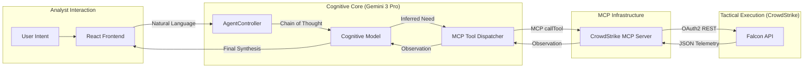
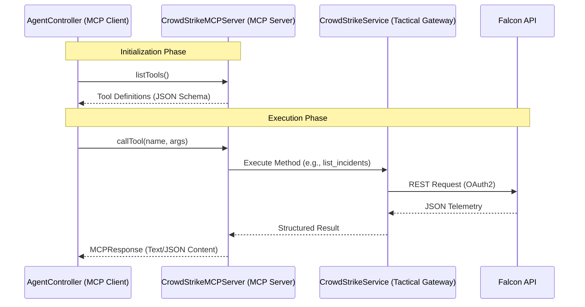

# AETHER | TECHNICAL SPECIFICATION & SYSTEM DOCUMENTATION

## Table of Contents
1.  [Executive Summary](#1-executive-summary)
2.  [System Architecture Deep-Dive](#2-system-architecture-deep-dive)
3.  [Component Specifications](#3-component-specifications)
4.  [MCP Integration & Protocol Architecture](#4-mcp-integration--protocol-architecture)
5.  [Core Security Heuristics & Playbooks](#5-core-security-heuristics--playbooks)
6.  [Security, Privacy & Data Integrity](#6-security-privacy--data-integrity)
7.  [Conclusion](#7-conclusion)

---

## 1. Executive Summary
**AETHER** is an elite agentic security orchestration platform designed to eliminate the latency between detection and remediation. By fusing the **Gemini 3 Pro** cognitive model with **CrowdStrike Falcon's** global telemetry, AETHER provides a semi-autonomous reasoning layer that acts as a force multiplier for Security Operations Centers (SOCs).

The platform transitions from the traditional "dashboard-only" approach to an "active reasoning" model. Instead of simply presenting alerts, AETHER interrogates the environment, correlates disparate telemetry points, and offers high-confidence tactical recommendations. This reduces the cognitive burden on analysts and ensures that critical decisions are supported by real-time data synthesis.

---

## 2. System Architecture Deep-Dive

To maintain the high performance required for real-time security operations, AETHER is built on a modular, three-tier architecture. This design ensures that cognitive processing does not bottleneck telemetry ingestion, creating a seamless pipeline from raw signal to executive conclusion.

### Figure 1: The AETHER Cognitive Reasoning Loop

<b>Figure 1: The AETHER Cognitive Reasoning Loop (MCP-Native)</b>

**Detailed Figure Breakdown:**
*   **Analyst Interaction**: The cycle initiates at the UI layer, where user intent is captured via natural language or playbook triggers and passed to the orchestration core.
*   **Cognitive Core**: The `AgentController` acts as an MCP client, initializing a Gemini 3 Pro session. The model uses a 32,768-token "Thinking Budget" to parse the request and identify telemetry gaps.
*   **MCP Infrastructure**: When the model identifies a need for data, it issues a `functionCall` which the `AgentController` routes through the appropriate MCP Server.
*   **Tactical Execution**: The `CrowdStrikeMCPServer` executes the request via the CrowdStrike REST API.
*   **Recursive Observation**: API results are returned through the MCP layer to the model as "Observations." The model re-evaluates its reasoning, potentially issuing further tool calls or synthesizing a final forensic report if the evidence is sufficient.

---

## 3. Component Specifications

The transitions between reasoning and execution are facilitated by five primary software components, each optimized for specialized roles within the security lifecycle.

### 3.1 `AgentController` (The Orchestration Core)
The `AgentController` is the primary interface between the UI and the AI. It manages the chat history and the recursive logic required for multi-step investigations.
- **MCP-Native**: Now operates as a Model Context Protocol client, dynamically discovering tools from registered MCP servers.
- **Thinking Budget**: Specifically utilizes `thinkingConfig: { thinkingBudget: 32768 }`. This is critical for security tasks where the model must "pre-visualize" complex process trees and network flows before generating a text response.
- **Recursive Tool Handling**: Implements an asynchronous loop that automatically resolves tool requests. This ensures that when an analyst asks for "The root cause," the AI might make 3-4 API calls (List Incidents -> Get Host -> Get Detections) before finally answering, all without further user input.

### 3.2 `CrowdStrikeMCPServer` (The Tool Provider)
A specialized implementation of the MCP `MCPServer` interface that exposes CrowdStrike Falcon capabilities to the AI.
- **Tool Discovery**: Implements `listTools()` to provide the AI with a standardized schema of available security operations (e.g., `contain_host`, `get_detections`).
- **Execution Routing**: Implements `callTool()` to map AI-generated function calls to the underlying `CrowdStrikeService` methods.

### 3.3 `CrowdStrikeService` (The Tactical Gateway)
A robust, class-based integration for the Falcon REST API, focusing on secure telemetry retrieval and kernel-level host actions.
- **Token Management**: Implements a self-healing OAuth2 flow. It monitors `tokenExpiry` and refreshes credentials 60 seconds before expiration to prevent session drops during active investigations.
- **Service Resilience**: Includes specific error handling for decommissioned endpoints (HTTP 410) and scope-denied errors (HTTP 403), providing clear, actionable feedback to the UI if permissions are insufficient.

### 3.4 `App.tsx` (Global State & Autonomous Monitoring)
The root component serves as the application's central nervous system, maintaining the "Pulse" of the security environment.
- **Auto-Pilot Engine**: A 30-second polling loop that watches for "Critical" incidents. If detected, it automatically kicks off an investigation by injecting a "SYSTEM ALERT" message into the chat stream, performing autonomous triage while the analyst is away.
- **API State Tracker**: Tracks whether the platform is `IDLE`, `STABLE`, or in `ERROR`. This state dictates UI interactivity and manages the placeholder logic for the command interface.

### 3.5 `ChatMessage.tsx` (Forensic Rendering)
This component transforms raw data and AI responses into a clinical, readable forensic timeline.
- **Markdown Support**: Renders analytical reports with support for technical tables, code blocks, and lists.
- **Tactical Modules**: Custom UI blocks that display raw tool inputs/outputs. This "Show Your Work" feature allows analysts to verify the AI's data sources and maintain full oversight of the investigation's integrity.

---

## 4. MCP Integration & Protocol Architecture

AETHER leverages the **Model Context Protocol (MCP)** to decouple the reasoning engine from the tactical execution layer. This standardization allows for seamless tool discovery and robust error handling across disparate security services.

### Figure 2: MCP Tool Discovery & Execution Flow

<b>Figure 2: MCP Tool Discovery & Execution Flow</b>

### 4.1 The MCP Client (AgentController)
The `AgentController` acts as the primary MCP Client. During initialization, it iterates through all registered servers and calls `listTools()`. These tools are then converted into Gemini-compatible `FunctionDeclarations`.
- **Schema Translation**: The client automatically maps MCP JSON Schemas to Gemini's `Type` system (e.g., mapping `integer` to `Type.INTEGER`).
- **Context Injection**: The server names are injected into the system instruction, allowing the model to understand the origin and purpose of each tool (e.g., `[crowdstrike-falcon-mcp] get_detections`).

### 4.2 The MCP Server (CrowdStrikeMCPServer)
The `CrowdStrikeMCPServer` implements the core MCP interface, acting as a secure proxy for the Falcon API.
- **Standardized Interface**: By implementing `listTools()` and `callTool()`, the server provides a consistent contract that the AI can rely on, regardless of the underlying API's complexity.
- **Error Normalization**: Tool execution errors are caught at the server level and returned as structured `isError: true` responses. This prevents raw API crashes from destabilizing the AI's reasoning loop.

### 4.3 Tool Execution Lifecycle
1.  **Discovery**: Upon boot, the Agent fetches tool schemas from the MCP Server.
2.  **Inference**: The Gemini model identifies a tactical need and generates a `functionCall`.
3.  **Dispatch**: The Agent routes this call to the specific MCP Server by name.
4.  **Translation**: The MCP Server maps the tool name to a specific method in the `CrowdStrikeService`.
5.  **Observation**: The result is returned to the model, which incorporates the new data into its next "Thinking" cycle.

---

## 5. Core Security Heuristics & Playbooks

AETHER transitions from raw data to intelligence by utilizing pre-defined "Playbooks"—structured heuristics that guide the AI's reasoning toward specific investigative outcomes.

### 5.1 Root Cause Analysis (RCA)
This playbook instructs the AI to pull a detection and "Walk the Tree." It retrieves parent process IDs (PPIDs) recursively to find the original execution point.

<b>Figure 3: Forensic Tree Reconstruction Logic</b>

**Detailed Logic Description**: The AI first uses `get_detections` to find the `cmd_line` of a malicious event. It then correlates this with `get_device_details` to verify the host's integrity. By comparing timestamps and process IDs, it constructs a chronological attack lineage that identifies the entry point (e.g., `outlook.exe` -> `powershell.exe` -> `mimikatz.exe`).

### 5.2 MITRE ATT&CK Framework Mapping
The system instruction enforces strict adherence to MITRE TTPs. 
- **Mapping**: Data from the `/detects` endpoint includes `technique` fields. AETHER identifies these (e.g., `T1059.001` for PowerShell) and renders them with high-visibility CSS to aid in reporting and tactical alignment.

---

## 6. Security, Privacy & Data Integrity

Given the sensitive nature of security telemetry, AETHER is built with "Zero-Trust" principles at the application layer.
- **Data Locality**: All API keys and secrets are processed client-side within the browser context. No telemetry data or credentials are ever sent to intermediary servers outside of the Google and CrowdStrike official clouds.
- **Principle of Least Privilege**: The platform requires specific API scopes to function correctly:
  - **Alerts**: `Read`
  - **Detections**: `Read`
  - **Incidents**: `Read`
  - **Hosts**: `Read` & `Write` (Write scope is required for kernel-level containment actions).
- **Handshake Verification**: Connections are tested upon entry to ensure the Client Secret is valid before the user can begin issuing commands, preventing broken investigation states.

---

## 7. Conclusion
**AETHER** transforms the traditional SOC workflow from manual data-gathering to high-level strategic oversight. By delegating the clinical labor of telemetry correlation to an agentic reasoning core, analysts can spend their time on what matters most: stopping the adversary.

As security landscapes become more complex, AETHER’s modular architecture allows it to evolve, incorporating new tools and higher-fidelity reasoning models as they become available, ensuring a future-proof defense posture.
