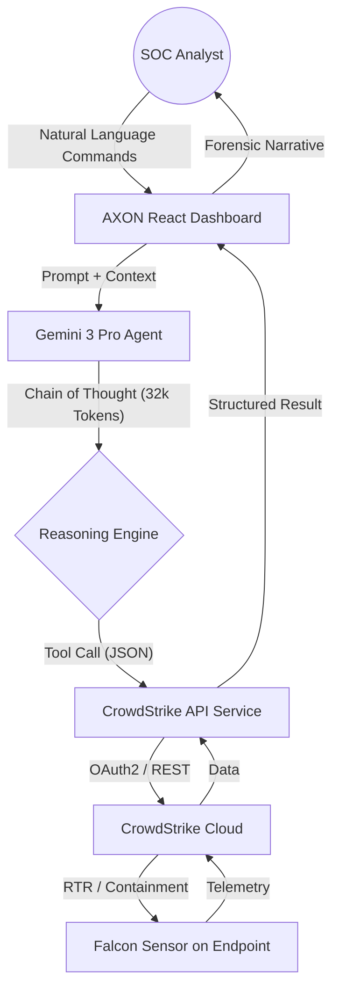

# AXON CORE // Neural Security Orchestration

**AXON CORE** is a next-generation, agentic AI platform designed for elite SOC analysts. While the standard **CrowdStrike Falcon Sensor** platform is the industry-leading telemetry and enforcement engine, **AXON CORE** acts as the *Cognitive Layer* sitting on top of it. 

By leveraging **Gemini 3 Pro’s** advanced reasoning, AXON transforms fragmented data into a unified "Neural Stream" of actionable intelligence.

---

## 💎 The Value Proposition: Why AXON?

CrowdStrike analysts typically spend 40% of their time "swivel-chairing" between different modules (Detections, Spotlight, Incidents, etc.). AXON CORE eliminates this friction.

| Feature | CrowdStrike Falcon Console | AXON CORE (Agentic) |
| :--- | :--- | :--- |
| **Analysis Loop** | Manual correlation of events across tabs. | **Autonomous Synthesis**: Cross-references incidents and telemetry automatically. |
| **Action Latency** | Menu-driven (Click → Action → Verify). | **Conversational**: "Isolate the source of the beaconing" executes in < 2s. |
| **Response MTTR** | Dependent on analyst speed/experience. | **Augmented**: Gemini 3 Pro provides Tier 3 forensic summaries instantly. |
| **Monitoring** | Reactive (Waiting for the alert to pop). | **Proactive**: "Neural Watch" loop investigates potential threats before you see them. |

---

## 🏗 System Architecture

AXON CORE uses a distributed reasoning architecture to ensure high-fidelity forensics and secure enforcement.

---

## 🛠 Tech Stack

- **Reasoning Core**: `gemini-3-pro-preview` with a 32,768 token "Thinking Budget".
- **Frontend**: React 19, Tailwind CSS, Lucide-inspired geometric design.
- **Backend Integration**: CrowdStrike Falcon API (OAuth2 / Devices-Actions v2).
- **Communication**: Agentic Function Calling via `@google/genai`.

---

## 🚀 Setup Guide

### 1. CrowdStrike API Configuration
AXON requires a **Client ID** and **Client Secret** with the following **API Scopes**:
- **Alerts**: Read
- **Detections**: Read
- **Hosts**: Read & Write (Write is required for Contain/Lift containment)
- **Incidents**: Read

**Steps:**
1. Log in to your CrowdStrike Falcon Console.
2. Navigate to **Support and Resources** > **API Clients and Keys**.
3. Create a new Client named "AXON_CORE".
4. Select the scopes listed above.
5. Copy the **Client ID**, **Secret**, and note your **Base URL** (e.g., `https://api.us-2.crowdstrike.com`).

### 2. Google Gemini API Key
This app requires a Google Gemini API Key. This is injected via `process.env.API_KEY`.

### 3. Application Launch
1. Open AXON CORE.
2. Click the **"Config"** button in the bottom left.
3. Enter your CrowdStrike Client ID, Secret, and select your Cloud Environment.
4. Click **"Connect"**. The indicator should turn green once synchronized.

---

## ⚡ Operational Playbooks

- **Neural Watch**: Activate this in the sidebar to have the agent proactively scan for new Critical incidents every 15 seconds.
- **Containment**: If a threat is confirmed, AXON will provide an "Axon Contain" button. This triggers kernel-level network isolation.
- **Restoration**: Once the asset is cleared, use the **"Lift Network Containment"** button within the chat stream to restore connectivity instantly.

---
*AXON CORE: Neural Defense. Strategic Dominance.*