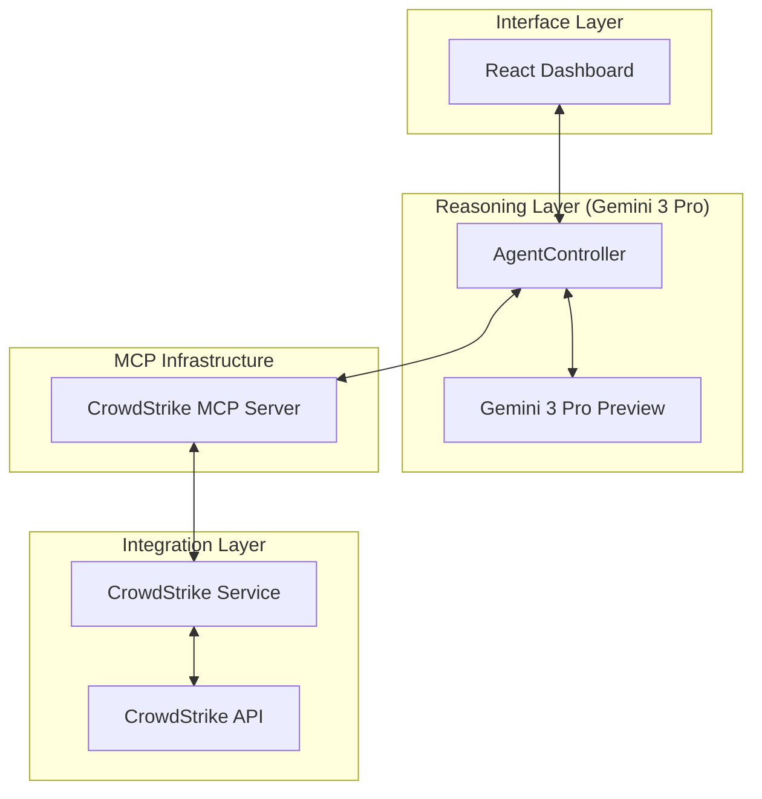

# AETHER - Autonomous Security Orchestrator

AETHER is a high-fidelity agentic security platform that synthesizes the reasoning of **Gemini 3 Pro** with the live telemetry of the **CrowdStrike Falcon API**. Built on the **Model Context Protocol (MCP)**, it acts as an autonomous security orchestrator, empowering analysts to execute deep forensic audits, trace attack lineages, and enforce network-level containment through an intuitive, technical interface.

### Key Features
* **Deep Forensic Audits**: Execute comprehensive analyses of incidents and alerts.
* **Attack Lineage Tracing**: Track and visualize the progression of potential threats.
* **Network-Level Containment**: Enforce immediate containment actions at the kernel level.
* **Live Telemetry Synthesis**: Combines CrowdStrike Falcon API data with Gemini 3 Pro reasoning.
* **MCP-Native Orchestration**: Seamless integration of high-stakes reasoning with raw data ingestion.

---

### Tech Stack
*   **Frontend**: React 19, Tailwind CSS
*   **Cognitive Engine**: Google Gemini 3 Pro (via `@google/genai`)
*   **Orchestration**: Model Context Protocol (MCP)
*   **Security Integration**: CrowdStrike Falcon REST API (OAuth2)
*   **Documentation**: Markdown, Mermaid.js, JetBrains Mono

---

### System Architecture
AETHER utilizes a four-tier decoupled architecture powered by the **Model Context Protocol (MCP)** to ensure that high-stakes reasoning is isolated from raw telemetry ingestion.


<p align="center"><b>Figure 1: MCP-Native System Architecture Overview</b></p>

---

### Architecture Flow Explanation
The AETHER ecosystem operates through a standardized cognitive loop:
1.  **Intent Capture**: The analyst interacts with the **Interface Layer**, which passes natural language intent to the **Reasoning Layer**.
2.  **Cognitive Reasoning**: The `AgentController` (acting as an MCP client) initializes a Gemini 3 Pro session. The model parses the request and identifies telemetry gaps in its current context.
3.  **Tool Discovery & Dispatch**: The Agent queries the **CrowdStrike MCP Server** for available tools. When a data need is identified (e.g., "List all critical incidents"), the Agent dispatches a standardized MCP tool call.
4.  **Telemetry Ingestion**: The MCP Server translates the request into specific REST API calls for the **CrowdStrike Service**. Raw telemetry is retrieved from the Falcon Cloud and returned as an "Observation".
5.  **Synthesis**: The model re-evaluates the forensic evidence and either issues further tool calls or synthesizes a final, expert-level report for the analyst.

---

### Setup Instructions

#### 1. Application Installation & Execution
To get AETHER running on your local environment, follow these precise steps:

1.  **Prerequisites**: 
    *   Install **Node.js** (v18 or higher recommended).
    *   Ensure **npm** is available in your terminal.
2.  **Clone & Install**:
    ```bash
    # Clone the repository (or download the source)
    cd aether-defense-core
    
    # Install required dependencies
    npm install
    ```
3.  **Environment Configuration**:
    The application requires a Google Gemini API key to power its cognitive reasoning engine.
    *   Create a `.env` file in the root directory.
    *   Add your key: `GEMINI_API_KEY=your_actual_key_here`
    *   *Alternatively*, set it in your terminal: `export GEMINI_API_KEY=your_key_here`
4.  **Launch Development Server**:
    ```bash
    # Start the Vite development server
    npm run dev
    ```
5.  **Access the Interface**:
    Open your browser and navigate to `http://localhost:3000`.

#### 2. Google Gemini API Setup
1.  Navigate to [Google AI Studio](https://aistudio.google.com/).
2.  Click on **"Get API key"** in the sidebar.
3.  Generate a new API key and copy it for use in your `.env` file or environment variables.

#### 3. CrowdStrike Falcon API Setup (Required Scopes)
To establish the tactical uplink, you must provision an API Client within the CrowdStrike Falcon Console (**Support and Resources > API Clients and Keys**). 

**Mandatory Scopes Configuration:**
*   **Alerts**: `Read`
*   **Detections**: `Read`
*   **Incidents**: `Read`
*   **Hosts**: `Read` & `Write` (The **Write** scope is essential for the kernel-level network containment features).

**Activation:**
Once your client is created, copy the **Client ID**, **Client Secret**, and identify your **Base URL** (e.g., `https://api.crowdstrike.com`). Open the **Settings** modal within the AETHER dashboard and input these credentials to initialize the MCP infrastructure.
