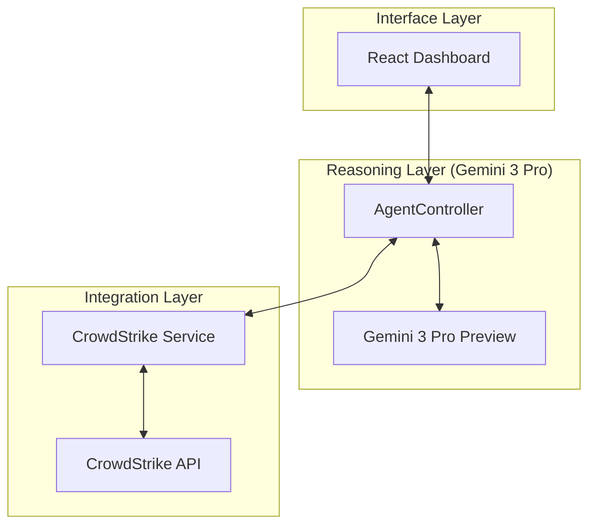

# AETHER - CrowdStrike Falcon Security Automation

### Brief Description
AETHER is a high-fidelity agentic security platform that synthesizes the reasoning of **Gemini 3 Pro** with the live telemetry of the **CrowdStrike Falcon API**. It acts as an autonomous security orchestrator, empowering analysts to execute deep forensic audits, trace attack lineages, and enforce network-level containment through an intuitive, technical interface.

---

### Key Features
*   **Autonomous Incident Triage**: Real-time monitoring and analysis of critical threats without manual intervention.
*   **Tactical Playbook Library**: One-click execution of advanced hunting strategies (RCA, Lateral Movement Sweeps, Identity Audits).
*   **Dynamic API Handshake**: Live health tracking of Falcon API connectivity with automated auth state management.
*   **MITRE ATT&CK Mapping**: High-precision identification of adversary techniques directly within the forensic stream.
*   **Kernel-Level Containment**: Direct orchestration of host isolation and restoration via the Falcon sensor.

---

### System Architecture
AETHER utilizes a three-tier decoupled architecture to ensure that high-stakes reasoning is isolated from raw telemetry ingestion.

<b>Figure 1: System Architecture Overview</b>

**Description**: The analyst interacts with the **Interface Layer**, which passes intent to the **Reasoning Layer**. Here, the Agentic Controller manages a multi-step thinking loop, querying the **Integration Layer** for specific telemetry data before synthesizing a final, expert-level report for the user.

---

### Tech Stack
*   **Frontend**: React 19, Tailwind CSS
*   **Cognitive Engine**: Google Gemini 3 Pro (via `@google/genai`)
*   **Security Integration**: CrowdStrike Falcon REST API (OAuth2)
*   **Documentation**: Markdown, Mermaid.js, JetBrains Mono

---

### Detailed Setup Steps

#### 1. Local Application Execution
To run AETHER on your local machine, follow these steps:
1.  **Prerequisites**: Ensure you have a modern web browser (Chrome or Edge recommended) and a local static file server.
2.  **Clone/Download**: Download the project files into a dedicated directory.
3.  **Environment Variable**: The application requires your Gemini API key to be present in the environment. Set the following variable in your terminal before launching your server:
    *   `export API_KEY=your_gemini_api_key_here` (macOS/Linux)
    *   `set API_KEY=your_gemini_api_key_here` (Windows)
4.  **Serve Files**: Use a static server to host the root directory. For example:
    *   `npx serve .`
    *   `python -m http.server 8000`
5.  **Access**: Open your browser to `http://localhost:3000` (or the port provided by your server).

#### 2. Google Gemini API Setup
1.  Go to the [Google AI Studio](https://aistudio.google.com/).
2.  Click **Get API Key** on the left sidebar.
3.  Create a new API key in a new or existing GCP project.
4.  Copy this key; it will be used as the `API_KEY` environment variable mentioned in the local setup.

#### 3. CrowdStrike Falcon API Setup
1.  Log in to your **CrowdStrike Falcon Console**.
2.  Navigate to **Support and Resources > API Clients and Keys**.
3.  Click **Create API Client**.
4.  Define a name (e.g., `AETHER_INTEGRATION`) and select the following scopes:
    *   `Alerts`: **Read**
    *   `Detections`: **Read**
    *   `Incidents`: **Read**
    *   `Hosts`: **Read**
    *   `Hosts`: **Write** (Required if you wish to use the Containment features)
5.  Save the Client and record the **Client ID**, **Client Secret**, and your **Base URL** (Cloud Environment).
6.  In the AETHER application, open **Settings** in the sidebar and input these credentials to establish the uplink.

---

### Additional Documentation
For deep technical specifications, logic flows, and component breakdowns, refer to the [Detailed Technical Documentation](DOCS.md).
