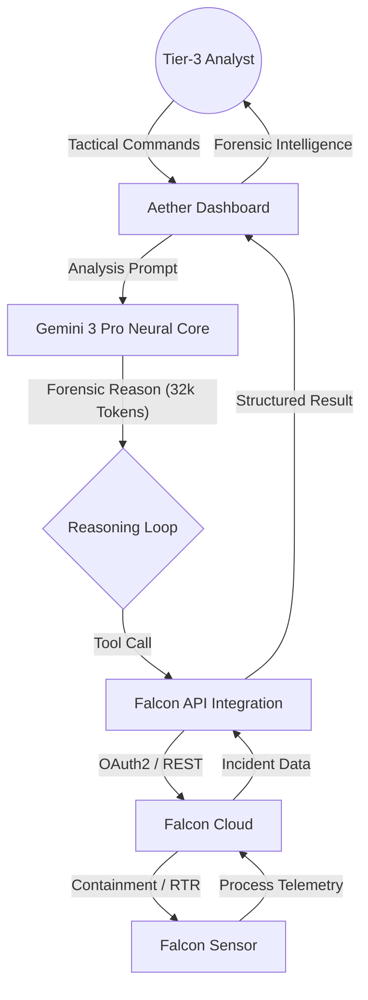

# AETHER: COGNITIVE DEFENSE CORE

Aether is an elite agentic AI platform designed to sit atop the CrowdStrike Falcon Sensor infrastructure, providing autonomous reasoning and high-fidelity forensic synthesis.

---

## THE COGNITIVE ADVANTAGE: WHY AETHER?

While the CrowdStrike Falcon Sensor provides industry-leading telemetry, Aether provides the **Cognitive Layer** required to navigate complex, modern attack vectors autonomously.

### Observation vs. Reasoning
- **Falcon Sensor (Sensory Input)**: Captures kernel-level telemetry, process logs, and network flows.
- **Aether Core (Cognitive Processing)**: Analyzes the *intent* behind the telemetry. It autonomously builds process trees, identifies malicious patterns, and maps them to the MITRE ATT&CK framework in real-time.

### Next-Generation Agentic Features
1. **Autonomous Investigation**: In Active Monitoring mode, Aether does not wait for an analyst. When a high-severity alert triggers, the core proactively queries multiple APIs to build a comprehensive forensic timeline before the analyst even opens the dashboard.
2. **Neural Correlation**: Aether correlates siloed data from Incidents, Detections, and Asset metadata to identify attack progression (Lateral Movement) across the entire fleet.
3. **Conversational Orchestration**: Turn complex forensic questions into simple tactical commands. Aether handles the API orchestration, allowing Tier-3 analysts to focus on high-level strategy.

---

## NEURAL LOAD INDEX (NLI)

The Neural Load Index (NLI) is a high-fidelity pressure metric calculated in real-time to represent the total threat weight impacting the environment.

### Calculation Logic
The NLI utilizes a weighted summation of active telemetry:
`NLI = min(100, (Critical_Incidents * 20) + (Open_Incidents * 4))`

*   **Critical Incidents (Weight: 20)**: Incidents with a severity code of 80+.
*   **Open Incidents (Weight: 4)**: Total volume of "New" or "In Progress" incidents requiring triage.

### Operational Thresholds
*   **0% - 60% (Stable)**: Manageable threat landscape.
*   **60% - 70% (Elevated)**: Triage volume is approaching neural capacity.
*   **> 70% (Saturation)**: High-velocity campaign detected. Immediate escalation required.

---

## SYSTEM ARCHITECTURE

Aether leverages Gemini 3 Pro to perform "Thinking-First" security orchestration.



---

## INSTALLATION AND LOCAL SETUP

### Step 1: Secure Required API Keys

1.  **Google Gemini API Key**: 
    - Obtain an API Key from the Google AI Studio.
    - Note: This application requires access to the gemini-3-pro-preview model.
2.  **CrowdStrike API Client**:
    - Navigate to Support and Resources > API Clients and Keys in your Falcon Console.
    - Create a new Client with the following Minimum Scopes:
        - Alerts: Read
        - Detections: Read
        - Hosts: Read, Write
        - Incidents: Read

### Step 2: Environment Configuration

Expose your Gemini API key as an environment variable:

```bash
# macOS / Linux
export API_KEY='your_gemini_api_key_here'

# Windows (PowerShell)
$env:API_KEY='your_gemini_api_key_here'
```

### Step 3: Launch and Connect

1.  **Start Application**: Run the local dev server.
2.  **Access Dashboard**: Open http://localhost:3000.
3.  **Establish Core Link**:
    - Select the Settings button in the bottom-left.
    - Enter your Client ID, Client Secret, and Cloud Region.
    - Click Connect to synchronize the Aether Core.

---
**AETHER: NEURAL DEFENSE. COGNITIVE SUPERIORITY.**